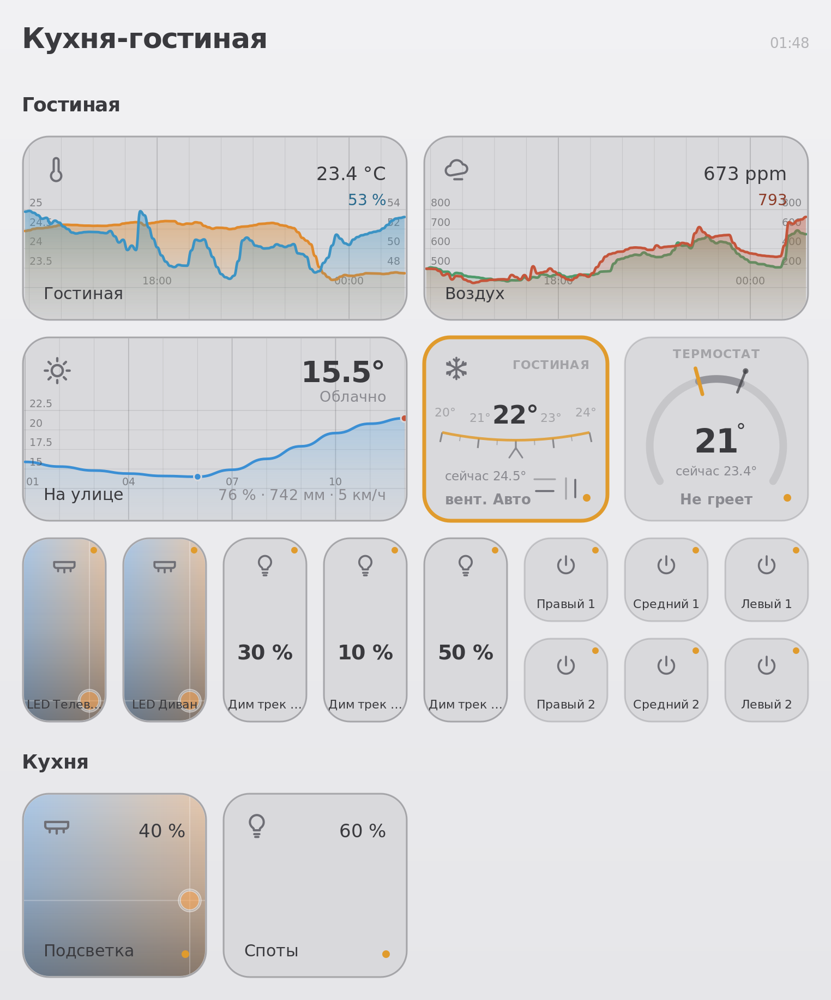

# wb-svg-panel

Панели умного дома для контроллеров [Wiren Board](https://wirenboard.com):
демон на Python отдаёт комнаты как SVG-картинки по HTTP. Открывается в любом
браузере, на планшете на стене, на телефоне, в киоск-режиме — везде, где есть
адрес контроллера.

<!-- Замените на свой скриншот: положите файл в docs/screenshot.png -->


Один процесс делает всё:

* держит постоянную подписку на `/devices/+/controls/+` и хранит состояние в памяти;
* тянет историю для графиков из `wb-mqtt-db` — напрямую из SQLite или через MQTT-RPC;
* рендерит панель через Jinja2 и отдаёт как `image/svg+xml`.

Вся внешность живёт в одном шаблоне `templates/panel.svg.j2`. Python туда не
лезет — он считает числа и геометрию. Хотите другой вид плитки — правите
шаблон, жмёте F5, рестарт не нужен.

## Чем это отличается от штатного веб-интерфейса

Веб-интерфейс Wiren Board — инструмент наладчика: списки устройств и каналов.
Эта панель — то, что показывают домашним: комнаты, крупные плитки, графики за
последние 12 часов, прогноз погоды. Она не заменяет вебморду, а живёт рядом,
по адресу `/panel/`.

## Что нужно

* контроллер Wiren Board (проверено на WB7, Debian 11 и Debian 12, Python 3.9+);
* `wb-mqtt-db` для графиков — он есть в прошивке из коробки;
* около 40 МБ на `/mnt/data`.

Всё, что рисует панель, берётся из MQTT. Устройства сторонних интеграций
(Sprut.hub, Zigbee2MQTT) работают, если они публикуются в тот же брокер:
достаточно указать полный топик вместо пары «устройство/канал».

## Установка

Код должен лежать на `/mnt/data` — это единственный раздел, который переживает
обновление прошивки.

```sh
ssh root@wirenboard-xxxxxxxx.local
apt update && apt install -y git
mkdir -p /mnt/data && cd /mnt/data
git clone https://github.com/USER/wb-svg-panel.git
cd wb-svg-panel
cp config.example.yaml config.yaml   # правим под свои устройства
sh install.sh
```

`install.sh` ставит зависимости, systemd-юнит и конфиг nginx. Он идемпотентен:
его же запускают после обновления прошивки, чтобы вернуть всё на место.

Панель открывается по `http://wirenboard-xxxxxxxx.local/panel/`.

### Обновление

```sh
cd /mnt/data/wb-svg-panel
git pull
systemctl restart wb-svg-panel
```

Рестарт нужен только после правок `panel.py`. Конфиг перечитывается сам по
времени изменения файла, шаблон — тоже (`auto_reload`), так что правки
внешности и раскладки видны сразу по F5. Если менялись `*.service`,
`nginx-*.conf` или список зависимостей — вместо рестарта `sh install.sh`.

## Адреса

| Адрес | Что отдаёт |
|---|---|
| `/panel/` | список панелей с живыми превью |
| `/panel/<имя>.svg` | панель картинкой |
| `/panel/<имя>.html` | обёртка с автообновлением и нажатиями — для планшета |
| `/panel/channels` | все каналы контроллера, чтобы искать имена для конфига |
| `/panel/docs` | подробный справочник по типам плиток |
| `/panel/healthz` | состояние демона |

Страница `.html` — это PWA: на телефоне её можно добавить на домашний экран,
и она откроется без адресной строки, как приложение.

## Конфиг

Всё описывается в `config.yaml` — какие панели, какие плитки, какие каналы.
Пример со всеми типами плиток: [`config.example.yaml`](config.example.yaml).

```yaml
panels:
  livingroom:
    title: "Гостиная"
    cols: 4
    tiles:
      - type: light
        title: "Лента у окна"
        channel_switch: "wb-led_42/CCT1"
        channel_brightness: "wb-led_42/CCT1 Brightness"
```

Типы плиток: `chart` · `forecast` · `thermostat` · `ac` · `light` · `dimmer` ·
`curtain` · `switch` · `value` · `link`.

Размеры задаются в половинках плитки: `0.5` — мелкая (78 px), `1` — обычная
(170 px), `2` — двойная (354 px). Панели можно собирать из других панелей через
`sections: [{from: kitchen}]` — плитки не дублируются, комнатная панель
помечается `hidden: true` и служит источником.

Имена каналов проще не набирать руками, а взять со страницы `/panel/channels`.
Если у вас настроены комнаты в веб-интерфейсе, черновик конфига сделает
`wb-rooms-to-config.py`.

## Шторы

Плитка `curtain` показывает положение створок и управляет приводом.
Короткое нажатие открывает или закрывает, долгое — открывает пульт: та же
плитка крупно, правая створка тянется от центра к краю.

```yaml
- type: curtain
  title: "Штора"
  channel: "wb-mcm8_15/Position"          # текущее положение, 0-100
  channel_state: "wb-mcm8_15/State"       # необязательно: едет или стоит
  command_topic: "…"                      # куда писать, если канал сырой
  command_topic_stop: "…"                 # необязательно: остановка на ходу
  command_stop: "2"
  command_open: "100"                     # по умолчанию 100
  command_close: "0"                      # по умолчанию 0
```

Кнопка «Стоп» на пульте появляется, только если задан `command_topic_stop`:
такая характеристика есть не у всех приводов, а рисовать неработающую кнопку
хуже, чем не рисовать вовсе.

Для каналов Wiren Board `command_topic` не нужен — адрес команды выводится из
имени канала. Для сырых топиков моста он обязателен, см.
[docs/DEVICES.md](docs/DEVICES.md).

Панель публикует команды только в топики, перечисленные в конфиге у
нарисованных плиток. Список конечный и собирается при каждом обращении, так
что новый топик в конфиге начинает работать сразу, а посторонний не пройдёт
даже при подмене запроса.

## Управление и доступ

По умолчанию панель только показывает. `interactive: true` включает нажатия:
свет, диммеры, шторы, выключатели. Демон при этом публикует команды **только**
в топики тех каналов, которые нарисованы на панели, — список конечный и берётся
из конфига.

Отсюда — про доступ. Панель, которая умеет включать свет, не должна быть
открыта всей сети. `install.sh` кладёт `nginx-panel-location.conf` в точку
расширения `/etc/nginx/includes/default.wb.d/`, где действует правило
`satisfy any`: пускает по адресу из списка подсетей **либо** по паролю.
Свою подсеть посмотрите через `ip -4 addr show` и поправьте список.

Запасной вход на порту 8080 (короткий адрес без `/panel/` — удобно для планшета
или ESP32) по умолчанию выключен. Включается явно:

```sh
sh install.sh --with-8080
sh close-8080.sh     # проверить, что и кому он открыт, и при желании закрыть
```

Наружу в интернет контроллер выставлять не надо — для удалённого доступа есть
Wiren Board Cloud или VPN.

## Если что-то не так

```sh
python3 diag.py             # файлы, зависимости, MQTT, база истории, конфиг
sh check-history.sh         # почему пустые графики
sh check-nginx.sh           # почему /panel/ отдаёт вебморду вместо панели
python3 why-no-chart.py     # разбор одного конкретного графика
journalctl -u wb-svg-panel -f
```

Самая частая причина пустых графиков — канал не пишется в `wb-mqtt-db` или
общий лимит группы `+/+` делится на сотни каналов. `check-history.sh` покажет
готовую группу для `/etc/wb-mqtt-db.conf`.

## Разработка

Ноутбук — единственное место, где меняется код; контроллеры только тянут.
Файл `config.yaml` в `.gitignore`: у каждого дома он свой, `git pull` его не
трогает.

Перед коммитом полезно прогнать `sh check-secrets.sh` — он ищет попавшие в
файлы имена контроллеров, облачные адреса, идентификаторы Sprut.hub и пароли.

CI проверяет совместимость с Python 3.9 (в прошивках на Debian 11 он ещё 3.9,
и синтаксис новее туда не поедет), синтаксис YAML и шелл-скрипты.

Issues и pull requests приветствуются. Особенно интересны новые типы плиток —
они добавляются макросом в `templates/panel.svg.j2` и небольшой функцией
подготовки данных в `panel.py`.

## Лицензия

MIT — см. [LICENSE](LICENSE).

Проект не связан с компанией Wiren Board и не поддерживается ею.
